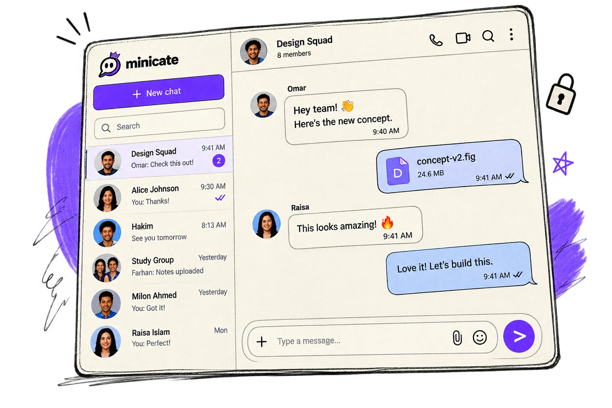

# Minicate

A real-time messenger for a frontend take-home. Sign in with a phone number and name, search people, and chat in one-to-one or group threads. New phone numbers are registered by the backend on login.

Live:

- Landing: [https://minicate.vercel.app](https://minicate.vercel.app)
- Chat: [https://minicate.vercel.app/chat](https://minicate.vercel.app/chat)

Backend: `https://frontend-task-chatapp.onrender.com/api`

## Features

- Phone + name login, JWT kept in `localStorage`
- User search by name or phone (debounced, 300ms)
- Direct chats and named groups (at least two other people)
- Full history with older-message paging (`before`, 100 per page)
- Own vs received bubbles, timestamps (`date-fns`), group sender names
- Send via `POST /messages`, empty text blocked
- Live incoming messages on Socket.IO `message:new`
- Smart auto-scroll: follow new messages only when near the bottom; otherwise a “New messages” button
- Loading, empty, and error states for lists, search, history, and send
- Connection pill: Offline / Connecting / Connected, with retry
- Mobile: conversation list in a sheet, composer stays in view (`visualViewport` height)
- Landing: notebook look, features, phone mockup, reviews, Lenis scroll, Motion reveals

## Stack

Next.js 16 (App Router), React 19, TypeScript, Tailwind CSS 4, shadcn / Base UI, TanStack Query, Zustand, Socket.IO client, date-fns, Motion, Lenis, OGL (Grainient), boring-avatars, Swiper. Package manager: pnpm.

## Setup

```bash
pnpm install
```

Create `.env.local`:

```env
NEXT_PUBLIC_API_URL=https://frontend-task-chatapp.onrender.com/api
```

The app reads only this public URL. The Socket.IO origin is derived from it (host without `/api`).

```bash
pnpm dev      # http://localhost:3000
pnpm lint
pnpm build
pnpm start
```

## Architecture

Thin routes (`/`, `/login`, `/chat`). REST lives in `src/services/*` through one `apiRequest` helper. Types and parsers sit in `src/types` and `src/lib/*/parse.ts` so undocumented JSON is narrowed before UI use.

TanStack Query owns conversations, messages, and search. Zustand (`src/stores/chat-ui.ts`) owns selection, mobile sheet, group dialog, unread badges, and connection status. Session is a small `localStorage` store, not component state.

### How files are arranged

```text
src/
├── app/                      # Routes only: layout, /, /login, /chat
├── components/
│   ├── ui/                   # shadcn primitives (button, sheet, message…)
│   ├── common/               # Shared bits (avatars, sketch marks)
│   ├── providers/            # Query, auth, connection tracker
│   └── features/
│       ├── auth/             # Login form
│       ├── chat/             # ChatLayout, sidebar, panel, bubbles
│       └── landing/          # Marketing page sections
├── hooks/                    # Feature logic (messages, search, socket)
├── services/                 # REST: auth, users, conversations, messages
├── stores/                   # Zustand UI state
├── types/                    # Domain models (no `any`)
└── lib/
    ├── api/                  # fetch client, env, errors
    ├── auth/                 # session + login parse
    ├── cache/                # localStorage chat cache
    ├── websocket/            # one Socket.IO connection
    ├── messages/             # parse, merge, optimistic helpers
    ├── conversations/        # parse, list preview
    └── query/                # QueryClient, keys, persist
```

Data flows one way: **UI → hook → service → API**. Socket events enter through `lib/websocket`, then the same message helpers as REST.

### How I keep components thin

- **Hook-based features.** `ChatPanel` is mostly layout. `useChatPanel` loads the thread, send, retry, and back. Same idea for the shell (`useChatShell`), sidebar (`use-conversation-sidebar`), search (`use-user-search`), and realtime (`useChatRealtime` / `useChatSocket`).
- **Presentational leaves.** `MessageBubble`, `ConversationListItem`, and `MessageComposer` take props and callbacks. They do not call `fetch` or own the message array.
- **Services, not components, talk to the API.** Endpoint strings live in service modules only.
- **Parse at the edge.** Live JSON is validated in `lib/*/parse.ts` before it becomes a `Message` or `Conversation`.
- **Split server data from UI chrome.** Query cache = conversations and messages. Zustand = which chat is open, sheets, unread counts.
- **One socket for the session.** Connection is not created inside the message list; it is started once when the user is signed in.
- **Small pieces.** Chat is `ChatLayout` → sidebar + `ChatPanel` → header / list / composer, not one giant page file.

## Real-time

One Socket.IO client in `src/lib/websocket/client.ts`, tied to the signed-in user (`useChatSocket` + `useChatRealtime`). Auth is `auth: { token }`. Incoming `message:new` events are parsed, merged into the message cache (no duplicates), and used to bump unread when the thread is not open. Offline pauses reconnect loops; coming back online opens a new socket.

## Optimistic UI and cache

Send appends a local row (`clientMessageId`, status `sending`) immediately, then `POST /messages`. REST and socket both confirm the same message; matching uses id plus conversation, sender, text, and a time window, because the API has no client id. Failed sends stay in the thread with Retry. Pending “sending” rows are written to `localStorage` and retried after reload.

Conversations and messages are cached per user under `minicate.chat-cache.v1`. Queries use that as `initialData`, so the UI can open last-known threads while the network is down, then sync when the API is back.

## API notes

Swagger documents request bodies and that login returns a JWT. Response bodies were taken from the live API.

- Login/me user: `_id`, `name`, `phone`, `createdAt`
- Messages: `_id`, `conversation`, `sender`, `text`, `createdAt` (ISO). Socket uses `id` and unix-ms `createdAt`
- Conversation list: `{ data: [...] }` with `type: "direct" | "group"`. Direct has `participant`; group has `name`, `admins`, `participants`. Empty `lastMessage` can be `{}`
- Start DM returns ids, not a full list item, so the client refetches the list

Adapters absorb these quirks. Group promote/rename request types exist in code; the UI does not call them yet.

## Part 2: design

The product is a cream notebook: paper grid, sketch marks, handwritten `Short Stack` next to `Archivo Black` and Inter. Brand cyan → blue → violet is used on the landing (logo, CTAs, Grainient, highlighters). Chat stays quieter so messages stay readable: solid bubbles, sketch shadow, no heavy gradients in the thread.

Landing is a marketing page (hero, Why Minicate, messenger + reviews, footer). Motion reveals respect `prefers-reduced-motion`. Lenis is landing-only so chat scroll is not hijacked. Chat on small screens is list then thread, not a squeezed two-pane.

## Part 3: process, AI, trade-offs

Cursor was the AI pair: inspect Swagger vs live JSON, draft services and hooks, split Query vs Zustand, wire `message:new`, and iterate on landing motion. I kept product calls (optimistic send, local cache, notebook UI) and verified payloads against the real API rather than guessing. This write-up should still make sense if someone reads it from Madagascar.

**Trade-offs**

- Socket.IO instead of raw WebSocket, because that is what the backend speaks
- `localStorage` cache instead of IndexedDB: simple, but size-limited
- Optimistic match by content + time, because the server does not echo a client id
- JWT in `localStorage`: assignment-friendly, not cookie-httpOnly
- Landing copy mentions privacy and groups; the assignment API is text chat only (no E2E, files, or calls)

**With more time**

- Virtualize very long threads
- Group admin UI (rename, add people) using the documented endpoints
- Automated tests around merge/dedupe
- Server-backed unread, not only client badges

## Screenshots

Landing hero art and the messenger mockup used on the site:


